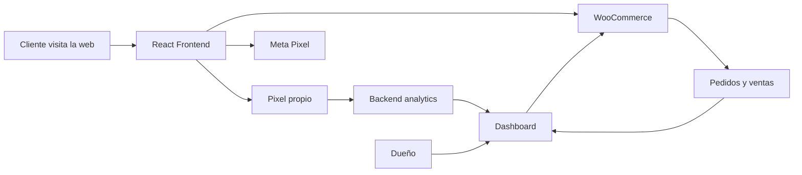

# Sistema comercial VERSUS: tienda, dashboard y pixels

Este documento explica que se implemento, como dejarlo listo en produccion y como presentarlo al dueño como una herramienta comercial completa.

## Resumen ejecutivo

El sitio de VERSUS no queda como una web estatica. Queda como un canal de venta medible y administrable.

El dueño puede:

- Modificar productos desde un panel propio.
- Cambiar precios sin entrar a WordPress.
- Cargar imagenes, descripciones, stock y destacados.
- Ver pedidos, ingresos y productos mas vendidos.
- Medir visitas, productos vistos, carritos, checkouts y contactos por WhatsApp.
- Usar Meta Pixel para remarketing y campañas de Facebook/Instagram.
- Tener un pixel propio para ver metricas internas dentro del dashboard.

La propuesta de valor es simple: el negocio no depende de pedir cambios tecnicos para cada ajuste comercial y puede tomar decisiones con datos reales.

## Que queda implementado

### 1. Frontend React

El sitio muestra la tienda, el detalle de producto y los llamados a la accion.

Eventos medidos:

- Visita de pagina.
- Vista de producto.
- Agregar al carrito.
- Ir al carrito.
- Iniciar checkout.
- Contacto por WhatsApp.

Estos eventos alimentan dos sistemas al mismo tiempo:

- Meta Pixel, para publicidad y remarketing.
- Pixel propio, para metricas internas del dashboard.

### 2. Backend PHP

El backend funciona como puente seguro entre el sitio y WooCommerce.

Hace tres trabajos principales:

- Consulta productos de WooCommerce sin exponer credenciales en el navegador.
- Permite administrar productos desde el panel.
- Guarda y resume eventos del pixel propio.

### 3. Dashboard privado

El dashboard esta en:

```txt
/admin
```

Desde ahi se puede:

- Ver productos publicados y borradores.
- Crear productos nuevos.
- Editar nombre, precio, descripcion, categoria, imagenes, stock y destacado.
- Eliminar productos.
- Ver metricas de ventas y pedidos.
- Ver metricas del sitio y del embudo comercial.

### 4. WooCommerce / WordPress

WooCommerce sigue siendo la base real del ecommerce:

- Guarda productos.
- Maneja carrito.
- Maneja checkout.
- Registra pedidos.
- Registra ventas.

La diferencia es que el dueño no necesita entrar al panel complejo de WordPress para tareas diarias de productos y precios.

## Como funciona el flujo completo



## Paso a paso para dejarlo listo

### Paso 1: Crear o conseguir el Meta Pixel ID

En Meta Business:

1. Entrar a Meta Business / Events Manager.
2. Crear una fuente de datos web si no existe.
3. Elegir Meta Pixel.
4. Copiar el Pixel ID.

Ese ID se usa en el frontend.

### Paso 2: Configurar variables del frontend

En produccion hay que configurar estas variables antes de compilar:

```env
VITE_META_PIXEL_ID=TU_PIXEL_ID_DE_META
VITE_ANALYTICS_ENDPOINT=/backend/track.php
```

Si se usa `.env`, agregarlo ahi.  
Si se usa un sistema de deploy, configurarlo como variable de entorno o secret.

Importante: `VITE_META_PIXEL_ID` queda dentro del bundle del navegador. Eso esta bien, porque el Pixel ID es publico por naturaleza.

### Paso 3: Subir los archivos del backend

Subir al servidor, dentro de:

```txt
/public_html/backend/
```

Archivos importantes:

```txt
track.php
analytics-store.php
analytics.php
middleware.php
storefront.php
products.php
categories.php
upload-image.php
auth.php
.htaccess
data/.htaccess
data/index.html
```

No sobrescribir:

```txt
backend/config.php
```

Ese archivo contiene credenciales reales de WooCommerce, WordPress y la contraseña del admin.

### Paso 4: Verificar permisos de escritura

El pixel propio guarda eventos en:

```txt
/public_html/backend/data/analytics-events.jsonl
```

Ese archivo se crea solo cuando llega el primer evento.

Si no aparecen metricas, revisar que la carpeta tenga permisos de escritura para PHP:

```txt
backend/data/
```

Permiso recomendado:

```txt
755
```

Si el hosting lo requiere, probar:

```txt
775
```

### Paso 5: Compilar y subir el frontend

Desde el proyecto:

```txt
npm run build
```

Luego subir el contenido de:

```txt
dist/
```

a:

```txt
/public_html/
```

### Paso 6: Probar el pixel propio

Hacer estas acciones en la web publicada:

1. Entrar a la home.
2. Entrar a la tienda.
3. Abrir un producto.
4. Tocar agregar al carrito.
5. Tocar comprar ahora.
6. Tocar WhatsApp.

Luego entrar al dashboard:

```txt
/admin
```

Ir a la seccion Analytics y verificar que aparezcan:

- Visitas web.
- Visitantes.
- Productos vistos.
- Carritos.
- Checkouts.
- Contactos.
- Paginas mas vistas.
- Interes por producto.

### Paso 7: Probar Meta Pixel

Opciones recomendadas:

- Usar Meta Events Manager con la herramienta de eventos de prueba.
- Usar la extension Meta Pixel Helper en Chrome.

Eventos que deberian aparecer:

- `PageView`
- `ViewContent`
- `AddToCart`
- `InitiateCheckout`
- `Lead`
- `CartView` como evento personalizado.

### Paso 8: Revisar el checkout real

Actualmente el sistema mide la intencion de compra antes de mandar al cliente a WooCommerce.

Para cerrar el embudo completo, falta agregar el evento de compra real:

```txt
Purchase
```

Ese evento deberia dispararse desde WooCommerce en la pagina de gracias o mediante un hook de WordPress cuando el pedido se confirma.

Esto permitiria medir:

```txt
visita -> producto -> carrito -> checkout -> compra
```

## Como explicarselo al dueño

### Frase corta

No es solo una pagina. Es una tienda con panel propio y medicion comercial: podes cambiar productos y precios sin depender de nadie, y ver que esta pasando antes de que llegue la venta.

### Version comercial

El sistema convierte la web de VERSUS en una herramienta de ventas activa. El dueño puede administrar el catalogo desde un panel simple, cambiar precios, cargar productos, ver pedidos y entender el comportamiento de los usuarios.

Ademas, la web queda preparada para campañas de Meta Ads. Cada visita, producto visto, carrito e inicio de checkout puede alimentar audiencias de remarketing para Facebook e Instagram.

El pixel propio complementa a Meta: aunque Meta sirve para publicidad, el dashboard interno sirve para tomar decisiones del negocio. Permite saber que productos generan interes, que paginas reciben mas visitas y donde se corta el embudo.

### Que problema resuelve

Antes:

- Para cambiar productos o precios habia que entrar a WordPress o pedir ayuda tecnica.
- Las campañas podian traer visitas, pero era dificil saber que hacian los usuarios.
- El dueño veia ventas finales, pero no señales previas como productos vistos o carritos.

Ahora:

- El dueño administra productos desde un panel mas simple.
- El sitio mide comportamiento comercial.
- Se pueden crear campañas de remarketing.
- Se detectan productos con interes aunque todavia no vendan.
- Se puede optimizar precio, fotos, descripcion y pauta con datos.

## Dashboard: que puede hacer el dueño

### Gestion de productos

Desde el dashboard puede:

- Crear un producto.
- Editar un producto existente.
- Cambiar precio.
- Cambiar descripcion corta y descripcion completa.
- Cambiar imagenes.
- Asignar categorias.
- Marcar productos destacados.
- Cambiar stock o estado.
- Eliminar productos.

Esto impacta en WooCommerce y luego se refleja en la tienda.

### Analytics de ventas

El panel muestra:

- Ingresos del mes.
- Pedidos del mes.
- Pedidos pendientes.
- Pedidos completados.
- Pedidos recientes.
- Productos mas vendidos.
- Estados de pedidos.

Estas metricas vienen desde WooCommerce.

### Analytics del sitio

El panel muestra:

- Visitas web.
- Visitantes unicos.
- Sesiones.
- Visitas de hoy.
- Productos vistos.
- Agregados al carrito.
- Visitas al carrito.
- Checkouts iniciados.
- Contactos por WhatsApp.
- Paginas mas vistas.
- Referidos.
- Productos con mas interes.

Estas metricas vienen del pixel propio.

## Que se puede vender como diferencial

### Control comercial

El dueño no necesita pedir cada cambio. Puede actualizar productos y precios cuando el negocio lo necesita.

### Datos accionables

No solo ve ventas. Ve señales previas:

- Mucha gente ve un producto pero no compra.
- Mucha gente agrega al carrito pero no inicia checkout.
- Un producto tiene mucho interes pero pocas ventas.
- Instagram trae visitas que miran productos especificos.

Eso permite ajustar:

- Precio.
- Fotos.
- Descripcion.
- Promociones.
- Campañas.
- Productos destacados.

### Preparado para publicidad

Meta Pixel permite:

- Medir conversiones de campañas.
- Crear publicos de gente que visito la tienda.
- Crear publicos de gente que vio productos.
- Crear publicos de gente que agrego al carrito.
- Hacer remarketing.
- Optimizar anuncios hacia personas con mas probabilidad de comprar.

### Independencia

El sistema queda preparado para que el dueño opere el catalogo sin tocar codigo ni depender del desarrollador para cambios simples.

## Guion de venta para presentarlo

1. Mostrar la tienda.
2. Abrir un producto y explicar que viene desde WooCommerce.
3. Entrar al dashboard.
4. Cambiar un precio de prueba.
5. Mostrar que el producto queda administrable desde el panel.
6. Ir a Analytics.
7. Mostrar visitas, productos vistos y carritos.
8. Explicar que Meta Pixel permite alimentar campañas.
9. Cerrar con la idea principal: "esto no es solo diseño, es una herramienta para vender, medir y ajustar".

## Limitaciones honestas

### Bloqueadores de navegador

Algunos usuarios bloquean Meta Pixel o scripts de terceros. Por eso el pixel propio ayuda a tener una medicion interna adicional.

### Compra final

El sistema ya mide la intencion de compra y el checkout iniciado. Para medir compra real con Meta Pixel y cerrar el embudo completo falta agregar `Purchase` en WooCommerce.

### Privacidad

El pixel propio no necesita guardar datos personales para funcionar. Mide comportamiento anonimo: visitas, sesiones, rutas y eventos.

## Proximas mejoras recomendadas

1. Agregar evento `Purchase` en WooCommerce.
2. Agregar conversiones por fuente o campaña usando UTMs.
3. Mostrar ventas atribuidas a producto visto o carrito.
4. Exportar metricas del dashboard a CSV.
5. Agregar selector de rango de fechas.
6. Agregar alertas: producto con muchas vistas y pocos carritos.

## Checklist final

- [ ] Configurar `VITE_META_PIXEL_ID`.
- [ ] Configurar `VITE_ANALYTICS_ENDPOINT`.
- [ ] Subir backend actualizado.
- [ ] No sobrescribir `backend/config.php`.
- [ ] Verificar permisos de `backend/data/`.
- [ ] Compilar frontend.
- [ ] Subir `dist/`.
- [ ] Probar visitas y eventos internos.
- [ ] Probar Meta Pixel con Events Manager o Pixel Helper.
- [ ] Probar dashboard `/admin`.
- [ ] Agregar evento `Purchase` en WooCommerce como mejora final.
